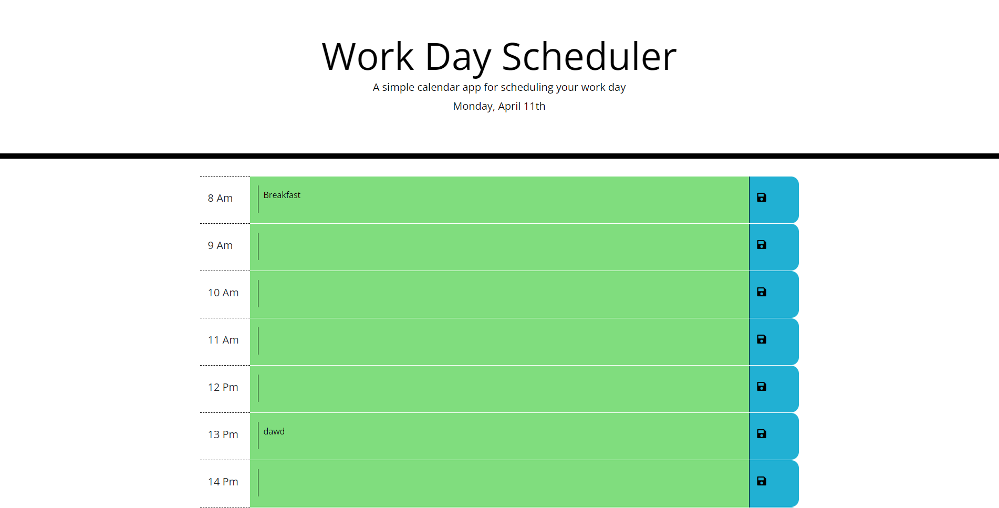

# Work-Day-Scheduler
A Work day scheduler

## Description

This is a work day scheduler.

## Table of Contents

-[Installation]
-[Usage]
-[Credit]
-[License]
-[Feature]

## Installation

There are no steps required for installation. You only require a web browser of the following (Chrome, Brave, Edge, etc.) to open up the webpage to view the content.

## Usage

## Credit

Louie Ip, GitHub for storage and hosting, Awesome Font, Bootstrap 4.3, Jquery 3.6

## License
 
Awesome Font, Bootstrap, Jquery

## Features

Webpage display and store your work day schedule.

## Deployment Link

https://louieiply.github.io/Work-Day-Scheduler/

